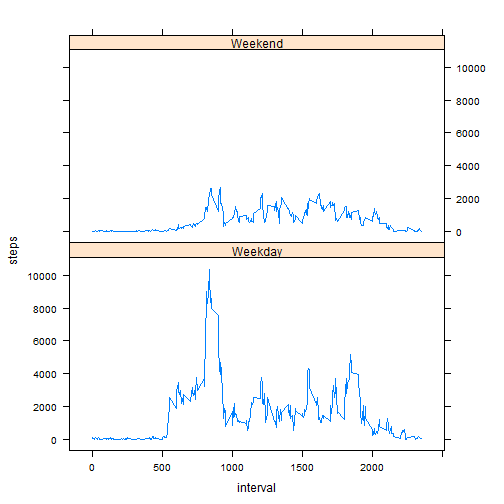

# Reproducible Research: Peer Assessment 1


## Loading and preprocessing the data

```r
library(plyr)
library(lattice)
unzip("activity.zip")
data <- read.csv("activity.csv")
```


## What is mean total number of steps taken per day?


```r
steps_day <- ddply(data, ~date, summarise, "steps" = sum(steps))
hist(steps_day$steps, breaks = 10, , col = "red", xlab = "Total Steps/Day", main = "")
```

 

```r
mean(steps_day$steps, na.rm=TRUE)
```

```
## [1] 10766
```

```r
median(steps_day$steps, na.rm=TRUE)
```

```
## [1] 10765
```

## What is the average daily activity pattern?


```r
daily_act <- ddply(data, ~interval, summarise, "steps" = sum(steps, na.rm=TRUE))
plot(daily_act, type="l")
```

 

```r
daily_act[daily_act$steps == max(daily_act$steps),]$interval
```

```
## [1] 835
```


## Imputing missing values


```r
nrow(data[is.na(data$steps),])
```

```
## [1] 2304
```

```r
missing <- data[is.na(data$steps),]
present <- data[!is.na(data$steps),]
intervals <- unique(missing$interval)
for (i in 1:length(intervals)){
        missing[missing$interval == intervals[i],]$steps <- 
                round(mean(present[present$interval == intervals[i],]$steps))
}
filled_data <- rbind(missing, present)
steps_day_filled <- ddply(filled_data, ~date, summarise, "steps" = sum(steps))
hist(steps_day_filled$steps, breaks = 10, , col = "red", xlab = "Total Steps/Day", main = "")
```

 

```r
mean(steps_day_filled$steps)
```

```
## [1] 10766
```

```r
median(steps_day_filled$steps)
```

```
## [1] 10762
```

The mean remained the same with imputed data, the median decreased sightly.

## Are there differences in activity patterns between weekdays and weekends?


```r
filled_data$date <- as.Date(filled_data$date)
filled_data$dayofweek <-weekdays(filled_data$date)
filled_data$typeofday <- NA
filled_data[filled_data$dayofweek %in% c("Monday", "Tuesday", "Wednesday",
                                          "Thursday", "Friday"),]$typeofday <- "Weekday"
filled_data[filled_data$dayofweek %in% c("Saturday", "Sunday"),]$typeofday <- "Weekend"
filled_data$typeofday <- as.factor(filled_data$typeofday)
daily_act_type <- ddply(filled_data, .(interval, typeofday), summarise, "steps" = sum(steps))
xyplot(steps~interval|typeofday, data = daily_act_type, type = "l", layout = c(1,2))
```

 
